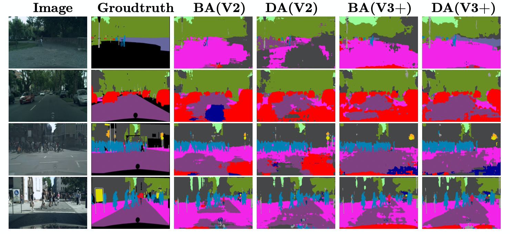
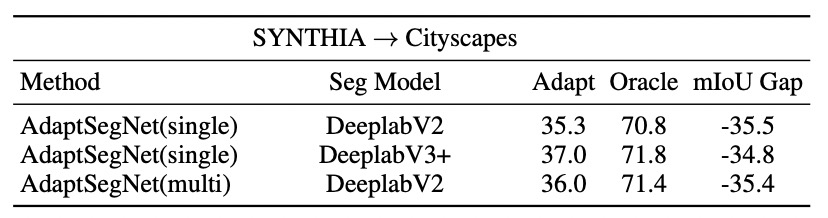
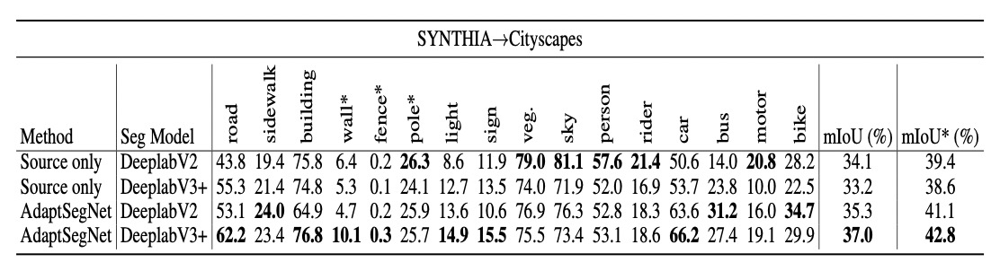
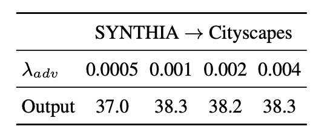
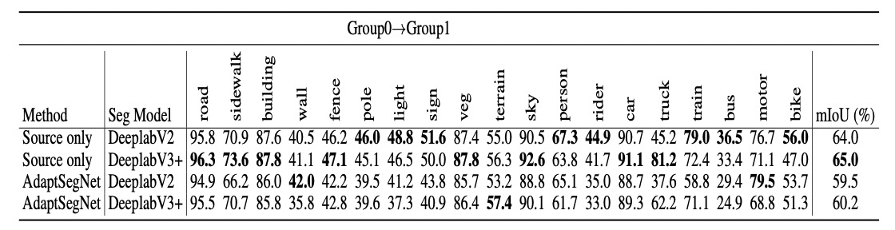

# Adversarial_DA_Exp

## Introduction



This project is **heavliy** based on [MaxSquareLoss](https://github.com/ZJULearning/MaxSquareLoss) and [Adaptation Seg](https://github.com/YangZhang4065/AdaptationSeg), [pytorch-deeplab-xception](https://github.com/jfzhang95/pytorch-deeplab-xception). Thanks a lot! 

* "[Paper: Domain Adaptation for Semantic Segmentation with Maximum Squares Loss](https://openaccess.thecvf.com/content_ICCV_2019/papers/Chen_Domain_Adaptation_for_Semantic_Segmentation_With_Maximum_Squares_Loss_ICCV_2019_paper.pdf)"
* "[Paper: Learning to Adapt Structured Output Space for Semantic Segmentation](https://arxiv.org/abs/1802.10349)"
* "[Paper: Encoder-Decoder with Atrous Separable Convolution for Semantic Image Segmentation](https://arxiv.org/abs/1802.02611)"

A **PyTorch** implementation for our **NCSU GEARS summer research program** experiment. The segmentation model is based on DeeplabV2 and DeeplabV3+ with ResNet-101 backbone. DeeplabV3+ models achieves competitive results on SYNTHIA-to-CITYSCAPES adversarial domain adaptation task. We also split the cityscapes dataset into two parts and apply output-level adversarial domain adaptation, hoping to see if the performance can be improved through our used domain adaptation method even two domains are quite similar. However, experimental results show that this adaptation **hurts** the performance. Due to time constraints

Due to time constraints, we **didn't tune the model to its best performance and improve the visual results**. This may be left as our future work. 

[Poster of this project(vertical)](https://evanfanbao.github.io/attaches/Gear2021_Bao_Feng-3.pdf)

[Poster of this project(horizontal)](https://evanfanbao.github.io/attaches/poster_h.pdf)

[Evaluation letter from Prof.Chi](https://evanfanbao.github.io/attaches/evaluation.pdf)

### Citation

If you use this code in your research, please cite aforementioned three git repos according to their requirements. Our code are free to use.

## Getting Started

These instructions below will get you a copy of the project up and running on your local machine for development and testing purposes.

### Prerequisites

Install the following

```
- Python >= 3.6
- Pytorch >= 1.0
```

Then, install python packages:

```
pip install -r requirements.txt
```


### Probe datasets

Those datasets involved in this project are:

* [SYNTHIA-RAND-CITYSCAPES](http://synthia-dataset.net/download/808/) . It consists of 9,400 1280 x 760 synthetic images. We resize images to 1280x760.
* [Cityscapes](https://www.cityscapes-dataset.com/). It contains 5,000 annotated images with 2048 x 1024 resolution taken from real urban street scenes. We resize Cityscapes images to 1024x512.

Make sure to download them and move to datasets/ folder.

Those datasets retain its orginal organization.

### Pretrained Models

* [Deeplabv2_resnet101 pretrained on imagenet](http://vllab.ucmerced.edu/ytsai/CVPR18/DeepLab_resnet_pretrained_init-f81d91e8.pth)

* Many pretrained models on SYNTHIA and CITYSCAPES datasets. Coming soon.

Make sure to move the Deeplabv2_resnet101pretrained model (DeepLab_resnet_pretrained_init-f81d91e8.pth) to pretrained_model folder.


## Training



**Pretraining on CITYSCAPES**

1. single + DeeplabV2

```shell
python3 tools/train_source.py --gpu "0" --dataset 'cityscapes' --checkpoint_dir "/nfs/byf/log/city_oracle_sv2" --iter_max 200000 --iter_stop 80000 --freeze_bn False --weight_decay 5e-4 --lr 2.5e-4 --crop_size "1280,720" --num_classes 19 --multi "False"  
```

		 2. multi + DeeplabV2

```shell
python3 tools/train_source.py --gpu "0" --dataset 'cityscapes' --checkpoint_dir "/nfs/byf/log/city_oracle_mv2" --iter_max 200000 --iter_stop 80000 --freeze_bn False --weight_decay 5e-4 --lr 2.5e-4 --crop_size "1280,720" --num_classes 19 --multi "True"
```

3. single + DeeplabV3

```powershell
python3 tools/train_source.py --gpu "0" --dataset 'cityscapes' --checkpoint_dir "/nfs/byf/log/city_oracle_sv3" --iter_max 200000 --iter_stop 80000 --freeze_bn False --weight_decay 5e-4 --lr 2.5e-4 --crop_size "1280,720" --num_classes 19 --multi "False" --backbone "deeplabv3_plus" --batch_size_per_gpu 2
```

**NOTE**: usually checkpoint_dir is "./log/your_dir_name"; the num_classes can be 19 or 16 depending on your purpose.


**Pretraining on SYNTHIA**

1.  single + DeeplabV2

```shell
python3 tools/train_source.py --gpu "0" --dataset 'synthia' --checkpoint_dir "/nfs/byf/log/synthia_pretrained_sv2" --iter_max 200000 --iter_stop 80000 --freeze_bn False --weight_decay 5e-4 --lr 2.5e-4 --crop_size "1280,720" --num_classes 16 --multi "False"
```

2. multi + DeeplabV2

```shell
python3 tools/train_source.py --gpu "0" --dataset 'synthia' --checkpoint_dir "/nfs/byf/log/synthia_pretrained_mv2" --iter_max 200000 --iter_stop 80000 --freeze_bn False --weight_decay 5e-4 --lr 2.5e-4 --crop_size "1280,720" --num_classes 16 --multi "True"
```

3. single + DeeplabV3+

```shell
python3 tools/train_source.py --gpu "0" --dataset 'synthia' --checkpoint_dir "/nfs/byf/log/synthia_pretrained_mv2" --iter_max 200000 --iter_stop 80000 --freeze_bn False --weight_decay 5e-4 --lr 2.5e-4 --crop_size "1280,720" --num_classes 16 --multi "True"
```


**Adversarial domain adaptation from SYNTHIA to Cityscapes**

1.  single + DeeplabV2

```shell
python3 tools/solve_synthia_adv.py --gpu "0" --dataset "cityscapes" --checkpoint_dir "/nfs/byf/log/synthia_city_v2_single"  --iter_max 200000 --iter_stop 80000 --freeze_bn False --weight_decay 5e-4 --lr 2.5e-4 --crop_size "1280,720" --backbone 'deeplabv2_multi' --num_classes 16 --multi False --pretrained_ckpt_file "/nfs/byf/log/synthia_pretrained_sv2"  
```

2. multi + DeeplabV2

```shell
python3 tools/solve_synthia_adv.py --gpu "0" --dataset "cityscapes" --checkpoint_dir "/nfs/byf/log/synthia_city_v2_multi"  --iter_max 200000 --iter_stop 80000 --freeze_bn False --weight_decay 5e-4 --lr 2.5e-4 --crop_size "1280,720" --backbone 'deeplabv2_multi' --num_classes 16 --multi True --pretrained_ckpt_file "/nfs/byf/log/synthia_pretrained_mv2"  
```

3. single + DeeplabV3+

```shell
python3 tools/solve_synthia_adv.py --gpu "0" --dataset "cityscapes" --checkpoint_dir "/nfs/byf/log/synthia_city_v3_single"  --iter_max 200000 --iter_stop 80000 --freeze_bn False --weight_decay 5e-4 --lr 2.5e-4 --crop_size "1280,720" --backbone 'deeplabv3_plus' --num_classes 16 --multi False --pretrained_ckpt_file "/nfs/byf/log/synthia_pretrained_sv3" --batch_size_per_gpu 2 
```

**NOTE**: please add like --round_num 5 --epoch_each_round 10 to extend traning. Usually, this does not need too much training. More information on args please see the code.




## Evaluation

Here we evaluate our results.

1. Source only + DeeplabV2

```shell
python3 tools/evaluate.py --gpu "0" --checkpoint_dir "/nfs/byf/log/synthia_pretrained_sv2/eval" --source_dataset 'synthia' --iter_max 200000 --iter_stop 80000 --freeze_bn False --weight_decay 5e-4 --lr 2.5e-4 --crop_size "1280,720" --num_classes 16 --multi "False" --pretrained_ckpt_file "/nfs/byf/log/synthia_pretrained_sv2/synthiabest.pth"
```

2. Source only + DeeplabV3+

```shell
python3 tools/evaluate.py --gpu "0" --checkpoint_dir "/nfs/byf/log/synthia_pretrained_sv3/eval" --source_dataset 'synthia' --iter_max 200000 --iter_stop 80000 --freeze_bn False --weight_decay 5e-4 --lr 2.5e-4 --crop_size "1280,720" --num_classes 16 --multi "False" --pretrained_ckpt_file "/nfs/byf/log/synthia_pretrained_sv3/synthiabest.pth" --backbone "deeplabv3_plus"
```

3. Adaptation + DeeplabV2

```shell
python3 tools/evaluate.py --gpu "0" --checkpoint_dir "/nfs/byf/log/synthia_city_v2_single/eval" --source_dataset 'synthia' --iter_max 200000 --iter_stop 80000 --freeze_bn False --weight_decay 5e-4 --lr 2.5e-4 --crop_size "1280,720" --num_classes 16 --multi "False" --pretrained_ckpt_file "/nfs/byf/log/synthia_city_v2_single/synthia2cityscapesbest.pth " --backbone "deeplabv2_multi"
```

4. Adaptation + DeeplabV3+

```shell
python3 tools/evaluate.py --gpu "0" --checkpoint_dir "/nfs/byf/log/synthia_city_v3_single/eval" --source_dataset 'synthia' --iter_max 200000 --iter_stop 80000 --freeze_bn False --weight_decay 5e-4 --lr 2.5e-4 --crop_size "1280,720" --num_classes 16 --multi "False" --pretrained_ckpt_file "/nfs/byf/log/synthia_city_v3_single/synthia2cityscapesbest.pth " --backbone "deeplabv3_plus"
```


## More

* We can do sensitivy analysis by changing "--lambda-adv-target1" arg. Here's our results for different $\lambda_{adv}$



* We also provide between-cityscapes domain adaptation(i.e., we split Cityscapes dataset into two parts, one as source domain and the other as target domain). Our assume that small shift can also be addressed by our method. However, results turn out to be **negative**.

	 

## Todo

* Release our pretrained models.

* Tune the model to get a better performance.

## Acknowledgement

We thank [Prof. Chi](https://www.csc.ncsu.edu/people/mchi) for insightful dicussions and ideas. We also thank North Carolina State University's GEARS program for providing us with such fulfilling research experience.

## Contact

If you have any question, please feel free to contact

Yifan Bao, yifanbao@zju.edu.cn

OR open an issue.


